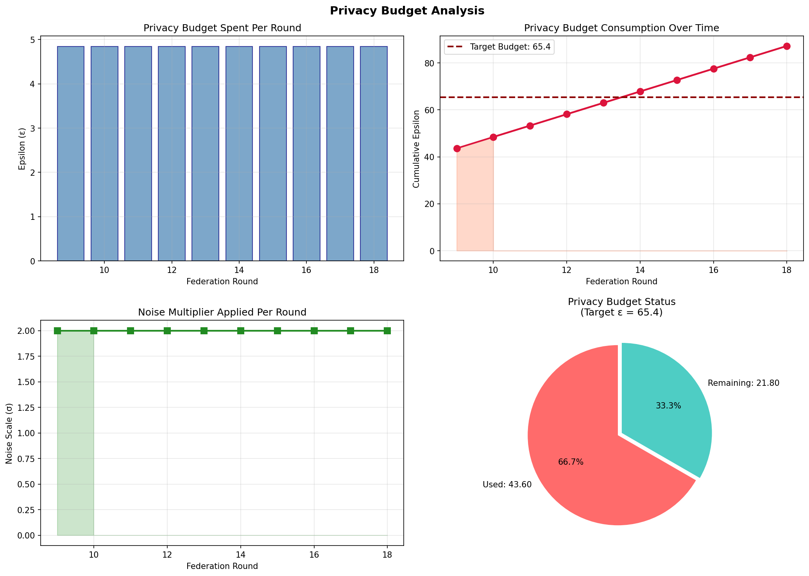
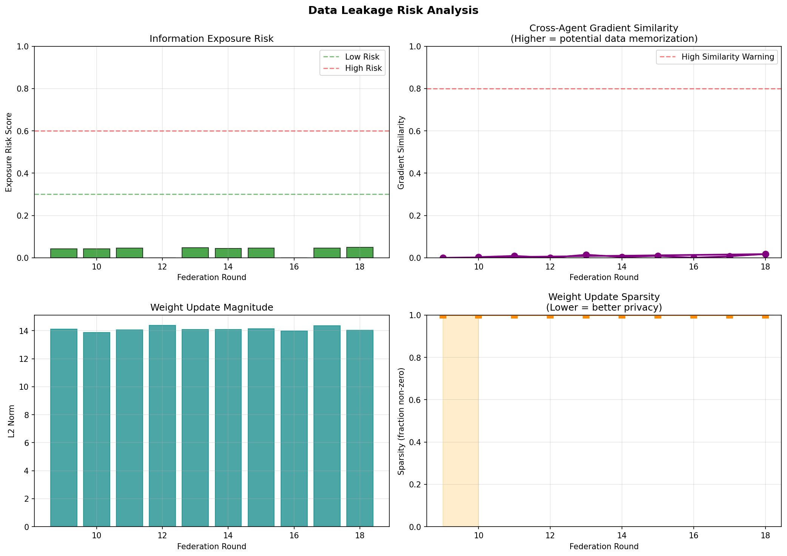
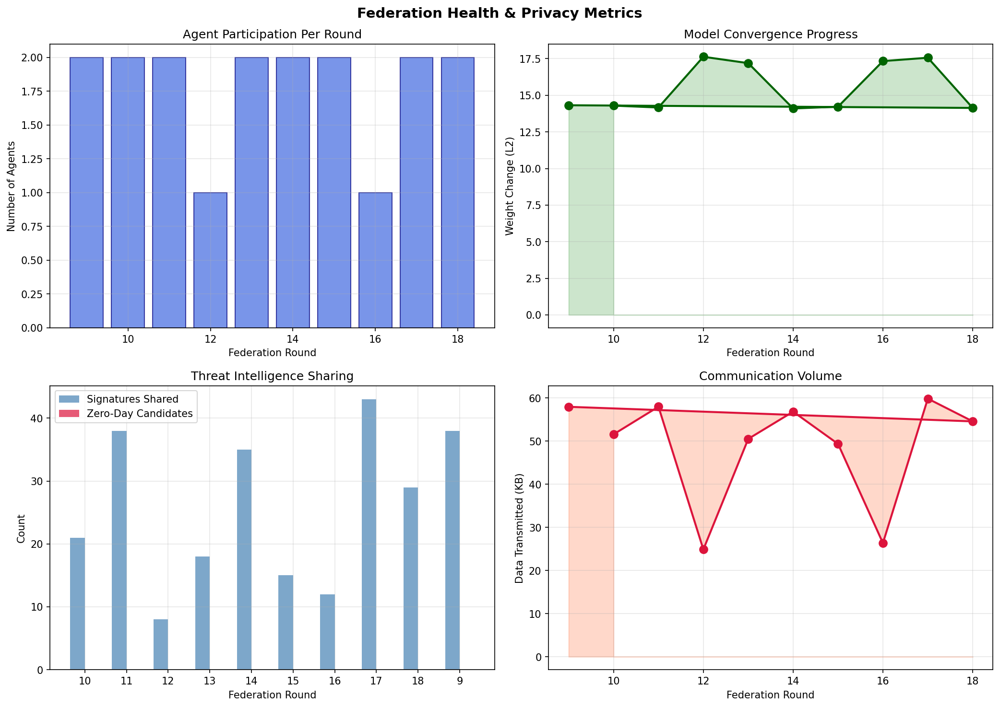
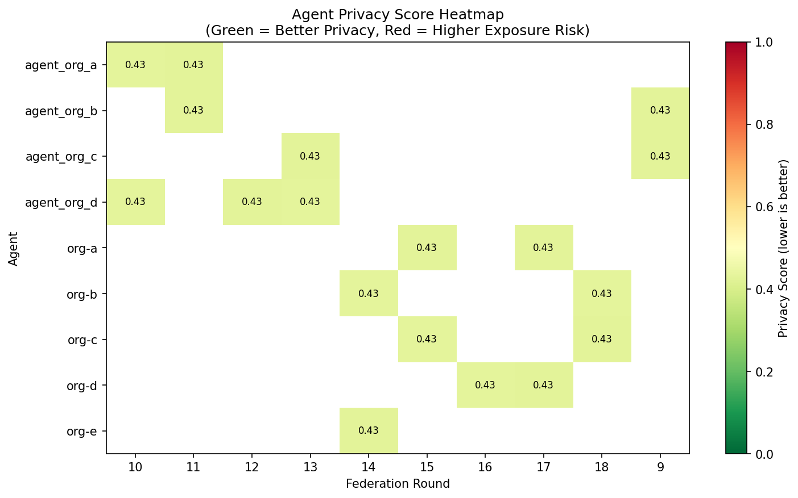

# Privacy Metrics for Federated Learning

This module provides comprehensive privacy metrics collection, analysis, and visualization for the Federated Learning system.

## Features

### Privacy Metrics Tracked

1. **Differential Privacy (DP) Metrics**
   - Epsilon (ε): Privacy budget consumed per round
   - Delta (δ): Privacy failure probability
   - Cumulative epsilon: Total privacy budget spent
   - Noise scale: Gaussian noise multiplier applied

2. **Data Leakage Risk Metrics**
   - Weight update magnitude: L2 norm of shared weights
   - Weight update sparsity: Fraction of non-zero parameters
   - Gradient similarity: Cross-agent gradient correlation (memorization indicator)
   - Information exposure risk: Composite risk score (0-1)

3. **Communication Privacy Metrics**
   - Bytes transmitted: Data volume per round
   - Embedding dimension: Dimensionality of shared signatures
   - Abstraction level: How abstracted/compressed shared data is
   - Signature count: Number of anomaly signatures shared

4. **Federation Health Metrics**
   - Participating agents: Number of agents per round
   - Total samples: Training samples contributed
   - Model convergence delta: Weight change from previous round
   - Zero-day candidates: New threats detected

## Installation

```bash
# Ensure matplotlib and pandas are installed
pip install matplotlib pandas
```

## Quick Start

### 1. Run Demo Simulation

Generate sample privacy metrics data:

```bash
cd fl-server
python demo_privacy_metrics.py --rounds 10 --agents 5 --visualize
```

### 2. Visualize Existing Metrics

If you have privacy metrics from real federation rounds:

```bash
cd fl-server
python visualize_privacy.py --log-path ./privacy_logs
```

### 3. Using the REST API

Start the FL server, then access privacy metrics via HTTP:

```bash
# Get privacy summary
curl http://localhost:9090/api/privacy/summary

# Get all rounds
curl http://localhost:9090/api/privacy/rounds

# Get specific round
curl http://localhost:9090/api/privacy/rounds/1

# Get privacy budget status
curl http://localhost:9090/api/privacy/budget

# Get text report
curl http://localhost:9090/api/privacy/report

# Get visualization (PNG)
curl http://localhost:9090/api/privacy/visualize/budget -o budget.png
curl http://localhost:9090/api/privacy/visualize/leakage -o leakage.png
curl http://localhost:9090/api/privacy/visualize/health -o health.png
curl http://localhost:9090/api/privacy/visualize/heatmap -o heatmap.png

# Export to CSV
curl http://localhost:9090/api/privacy/export/csv -o metrics.csv
```

## Visualizations

### Privacy Budget Chart
Shows epsilon consumption over rounds with remaining budget gauge.



### Leakage Risk Dashboard
Shows information exposure risk, gradient similarity, and weight update patterns.



### Federation Health
Shows participation, convergence, and communication volume.



### Agent Privacy Heatmap
Per-agent privacy scores across rounds.



## Configuration

Set environment variables to configure privacy metrics:

```bash
# Privacy budget configuration
export FL_TARGET_EPSILON=10.0      # Total privacy budget
export FL_TARGET_DELTA=1e-5        # Privacy failure probability
export FL_NOISE_MULTIPLIER=1.0     # Gaussian noise multiplier
export FL_CLIP_NORM=1.0            # Gradient clipping norm

# Logging
export FL_PRIVACY_LOG_PATH=./privacy_logs
```

## Python API

### Using PrivacyMetricsCollector

```python
from privacy.privacy_metrics import PrivacyMetricsCollector

collector = PrivacyMetricsCollector(
    log_path="./privacy_logs",
    target_epsilon=10.0,
    target_delta=1e-5,
    noise_multiplier=1.0,
    clip_norm=1.0
)

# Start a round
collector.start_round(round_id=1)

# Record agent updates
collector.record_agent_update(
    agent_id="agent_1",
    weights=model_weights,  # List[np.ndarray]
    sample_count=100,
    raw_bytes=4096
)

# Record signatures
collector.record_signatures(
    agent_id="agent_1",
    embeddings=np.array([...]),  # shape (N, D)
    recon_errors=np.array([...])  # shape (N,)
)

# End round and get metrics
metrics = collector.end_round(
    aggregated_weights=global_weights,
    zero_day_count=0
)

print(f"Round ε: {metrics.epsilon}")
print(f"Cumulative ε: {metrics.cumulative_epsilon}")
print(f"Exposure risk: {metrics.information_exposure_risk}")
```

### Using PrivacyAnalyzer

```python
from privacy.privacy_analyzer import PrivacyAnalyzer

analyzer = PrivacyAnalyzer(log_path="./privacy_logs")
analyzer.load_metrics()

# Generate all visualizations
analyzer.plot_privacy_dashboard(save=True, show=True)

# Generate specific visualization
analyzer.plot_privacy_budget(save=True, show=True)
analyzer.plot_leakage_risk(save=True, show=True)

# Generate text report
report = analyzer.generate_report(output_file="report.txt")
print(report)

# Export to CSV
analyzer.export_to_csv("metrics.csv")
```

## Understanding the Metrics

### Privacy Budget (Epsilon)

- **Lower is better**: Lower epsilon means stronger privacy guarantees
- **Target epsilon**: Your total privacy budget (e.g., 10.0)
- **Per-round epsilon**: Consumed budget each round
- When cumulative epsilon approaches target, consider stopping training

### Information Exposure Risk

- **Score 0-1**: 0 = low risk, 1 = high risk
- **< 0.3**: Low risk (green)
- **0.3-0.6**: Medium risk (orange)
- **> 0.6**: High risk (red)

### Gradient Similarity

- **High similarity (> 0.7)**: May indicate data memorization
- **Low similarity (< 0.3)**: Good - diverse updates from agents

### Recommendations

Based on metrics, the system provides actionable recommendations:

1. **High exposure risk**: Increase noise_multiplier
2. **High gradient similarity**: Consider local DP at client level
3. **Budget running low**: Reduce training rounds
4. **High weight density**: Apply gradient sparsification
5. **High communication volume**: Use compression techniques

## File Structure

```
fl-server/
├── privacy/
│   ├── __init__.py
│   ├── privacy_metrics.py    # Metrics collector
│   └── privacy_analyzer.py   # Visualization & analysis
├── api/
│   └── privacy.py            # REST API endpoints
├── demo_privacy_metrics.py   # Demo simulation script
├── visualize_privacy.py      # CLI visualization tool
└── privacy_logs/             # Generated logs
    ├── privacy_round_1.json
    ├── privacy_round_2.json
    └── visualizations/
        ├── privacy_budget.png
        ├── leakage_risk.png
        ├── federation_health.png
        └── agent_privacy_heatmap.png
```

## Integration

Privacy metrics are automatically collected when:
1. Agents submit updates via `/api/submit_update`
2. Model aggregation occurs (round completion)

No additional code changes needed in agents - the FL server handles all tracking.
